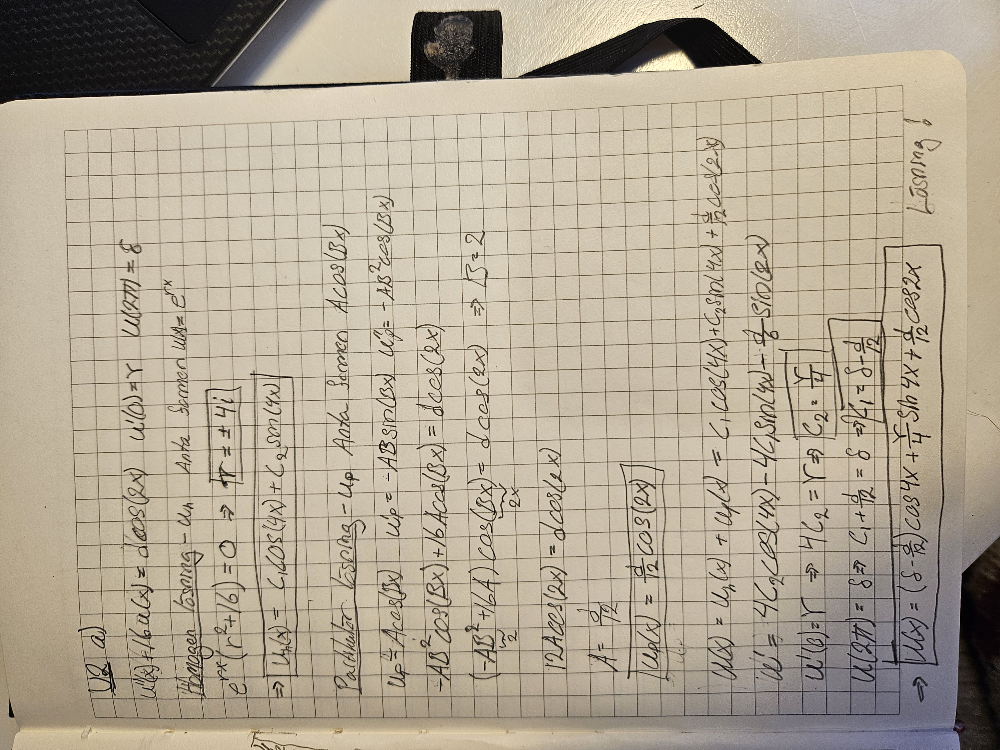

# projekt-2a
KTH SF1682 Projekt 2A
## U1

### a)
The solution to this task can be seen in the image below.

### b)

The absolute error (in the three methods) is compared with the theoretical error O(h^2) in the graph below. It clearly shows that the actual error is the theoretical one, multiplied with some constants. The reason for using a loglog plot is to: [write stuff here!!!].

## U2

### a)

The analytic solution to U2 a) can be seen in the image below.

